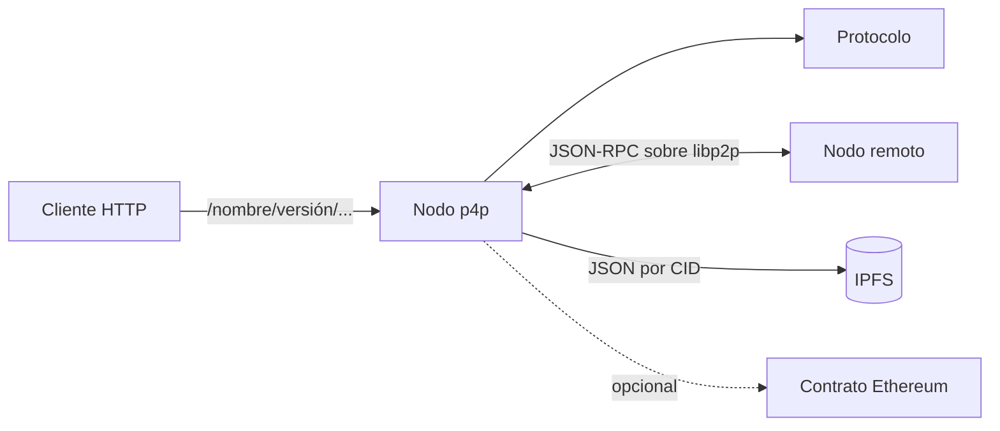

# p4p

Librería de Node.js para levantar nodos que exponen protocolos propios por HTTP y por JSON-RPC entre pares sobre libp2p, con almacenamiento compartido en IPFS.



## Por qué existe

Armar un servicio que corre en varios nodos sin un servidor central obliga a juntar piezas que no fueron pensadas para ir juntas. libp2p da transporte, cifrado, descubrimiento y streams, pero no da semántica de petición y respuesta: sobre un stream crudo cada proyecto termina inventando su propio framing, sus ids de mensaje y su manejo de errores. Helia da almacenamiento direccionado por contenido, pero no dice quién es cada nodo. ethers da una wallet, con otra clave más.

El resultado habitual es un nodo con tres identidades distintas, un protocolo de mensajes ad hoc y una API HTTP aparte para que las aplicaciones locales puedan hablar con él, todo repetido en cada proyecto.

p4p resuelve eso una sola vez. Una única clave secp256k1 es a la vez el peer ID de libp2p, el DID del nodo y la dirección de Ethereum. La lógica de negocio se escribe como un `Protocol`: un objeto con funciones, que queda accesible tanto por HTTP como desde otros nodos, sin escribir código de red.

## Ejemplo

```ts
import { Node, Protocol } from "p4p";

const echo = new Protocol({
    name: "echo",
    version: "1.0.0",
    p2pEndpoints: {
        say: async (text) => text.toUpperCase()
    },
    httpEndpoints: {
        say: {
            GET: async ({ to, text }, { node }) => {
                const remote = await node.rpc(to, "/echo/1.0.0");
                return { reply: await remote.say(text) };
            }
        }
    }
});

const node = await Node.create({
    storagePath: "./.data",
    p2p: {
        listeningAddresses: [{ host: "0.0.0.0", port: 4001 }],
        advertisingAddresses: [{ host: "203.0.113.10", port: 4001 }],
        knownPeers: []
    },
    network: { name: "demo", salt: "cambiar-esto", netmasks: ["0.0.0.0/0"], ethChainId: 1 },
    http: { host: "127.0.0.1", port: 8080 },
    protocols: [echo]
});
```

`GET /echo/1.0.0/say?to=<did>&text=hola` le pide al nodo `to` que ejecute `say` y devuelve la respuesta.

## Cómo funciona

Al arrancar, el nodo crea su carpeta de datos y genera una clave si no existe. Con ella levanta libp2p sobre TCP con Noise y Yamux, se conecta a los pares conocidos y participa de una DHT Kademlia. Encima corre Helia, que guarda los bloques en disco.

Una red es un JSON de configuración guardado en IPFS; su DID se deriva del CID. Crear una red publica ese JSON; unirse a una existente por su DID descarga la configuración desde los pares. Las máscaras de red de esa configuración filtran qué direcciones se anuncian en la DHT.

Cada protocolo se registra en libp2p como `/nombre/versión` y en HTTP bajo el mismo prefijo. `node.rpc()` devuelve un proxy: la cadena de propiedades se convierte en el nombre del método y la llamada viaja como JSON-RPC 2.0 con el DID de la red, que el receptor verifica. Si el destino es el propio nodo, se ejecuta en local sin pasar por la red.

## Qué no hace

Solo habla TCP sobre IPv4: no hay IPv6, DNS, transportes para navegador ni atravesamiento de NAT. El DID de red no es autenticación; cualquier par que lo conozca puede llamar a los endpoints, y el servidor HTTP tampoco autentica, así que conviene publicarlo solo en localhost. Los endpoints P2P reciben únicamente el primer argumento. Los datos en IPFS existen solo en los nodos que los guardaron.

No conviene usarlo con pares no confiables en internet abierta, ni cuando alcanza con una API cliente-servidor. Es una versión 0.1, sin tests, y la API puede cambiar.
