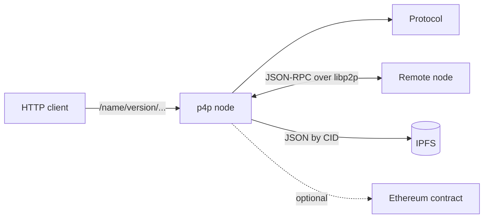

# p4p

A Node.js library for running nodes that expose custom protocols over HTTP and over peer-to-peer JSON-RPC on libp2p, with shared storage on IPFS.



## Why it exists

Building a service that runs across several nodes without a central server means combining pieces that were not designed to go together. libp2p provides transport, encryption, discovery and streams, but no request/response semantics: on top of a raw stream every project ends up inventing its own framing, message ids and error handling. Helia provides content-addressed storage, but says nothing about who each node is. ethers provides a wallet, with yet another key.

The usual result is a node with three separate identities, an ad hoc message protocol, and a separate HTTP API so local applications can talk to it, all rebuilt in every project.

p4p solves this once. A single secp256k1 key is at the same time the libp2p peer ID, the node's DID and its Ethereum address. Business logic is written as a `Protocol`: an object of functions that becomes reachable both over HTTP and from other nodes, with no networking code.

## Example

```ts
import { Node, Protocol } from "p4p";

const echo = new Protocol({
    name: "echo",
    version: "1.0.0",
    p2pEndpoints: {
        say: async (text) => text.toUpperCase()
    },
    httpEndpoints: {
        say: {
            GET: async ({ to, text }, { node }) => {
                const remote = await node.rpc(to, "/echo/1.0.0");
                return { reply: await remote.say(text) };
            }
        }
    }
});

const node = await Node.create({
    storagePath: "./.data",
    p2p: {
        listeningAddresses: [{ host: "0.0.0.0", port: 4001 }],
        advertisingAddresses: [{ host: "203.0.113.10", port: 4001 }],
        knownPeers: []
    },
    network: { name: "demo", salt: "change-me", netmasks: ["0.0.0.0/0"], ethChainId: 1 },
    http: { host: "127.0.0.1", port: 8080 },
    protocols: [echo]
});
```

`GET /echo/1.0.0/say?to=<did>&text=hello` asks node `to` to run `say` and returns its answer.

## How it works

On startup the node creates its data folder and generates a key if none exists. With it, it starts libp2p over TCP with Noise and Yamux, connects to the known peers and joins a Kademlia DHT. Helia runs on top of it and stores blocks on disk.

A network is a JSON settings document stored in IPFS; its DID is derived from the CID. Creating a network publishes that JSON; joining an existing one by DID downloads the settings from peers. The netmasks in those settings filter which addresses are announced in the DHT.

Each protocol is registered in libp2p as `/name/version` and in HTTP under the same prefix. `node.rpc()` returns a proxy: the property chain becomes the method name, and the call travels as JSON-RPC 2.0 tagged with the network DID, which the receiver checks. If the target is the node itself, it runs locally without touching the network.

## What it does not do

It only speaks TCP over IPv4: no IPv6, DNS, browser transports or NAT traversal. The network DID is not authentication; any peer that knows it can call the endpoints, and the HTTP server does not authenticate either, so bind it to localhost. P2P endpoints receive only the first argument. Data in IPFS exists only on the nodes that stored it.

Do not use it with untrusted peers on the open internet, or when a plain client-server API is enough. This is version 0.1, has no tests, and the API may change.
